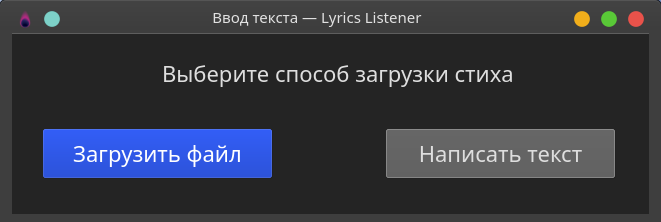
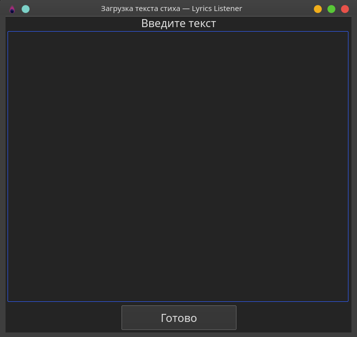
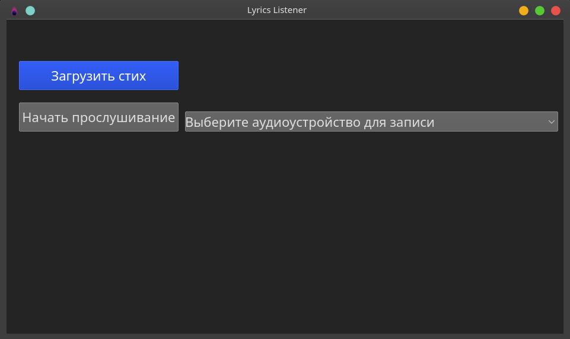
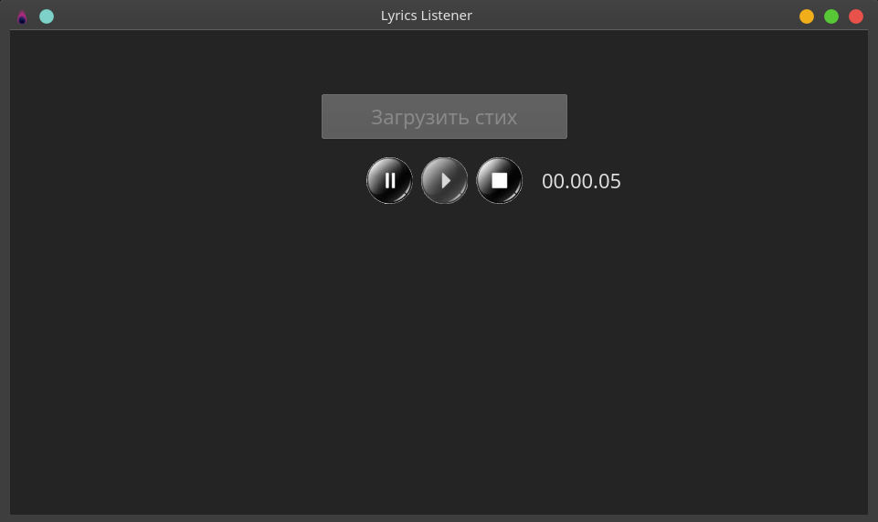

# Lyrics listener

## Requirements

### Compilers:
-  Python 3
-  GNU C++ 11.1.0

### Python libraries:
- PyQt5
- threading
- sys
- pymystem3
- abc
- vosk
- queue
- json
- sounddevice
- pybind11 (if you want use builder for c++ library)
- distuils.core (if you want use builder for c++ library)

### C++ libraries:
- string
- vector
- iterator
- algorithm
- iostream
- sstream
- set
- pybind11

## Launching the program

> For launch you need to download vosk model from https://alphacephei.com/vosk/models website, copy model files to VoskApi/vosk-model-ru and run MainEngine.py in your IDE or write in command line (you need to go to the app catalog) next command:

```python MainEngine.py```

## Building C++ library

> I already built library, but if you want change my algorithm for calculating similarity, you need to change checkResult function in C++ files and build it by writing next command:

```python BuildC++lib.py build_ext -i```

> Your library will locate in Lib folder after completing and have .so extension.

## What does this program do?

> My program listen speech live on air and check similarity with original lyrics.

## Why am I doing this?

> I want to improve my skills in software engineering and make helpful soft for people.

## Project info

> Developer: SokoMix \
> Year of development: 2021 \
> Tested on Linux Manjaro KDE

## Screenshots

 
 
 
 
